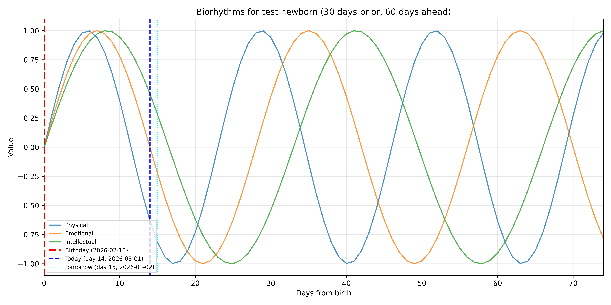
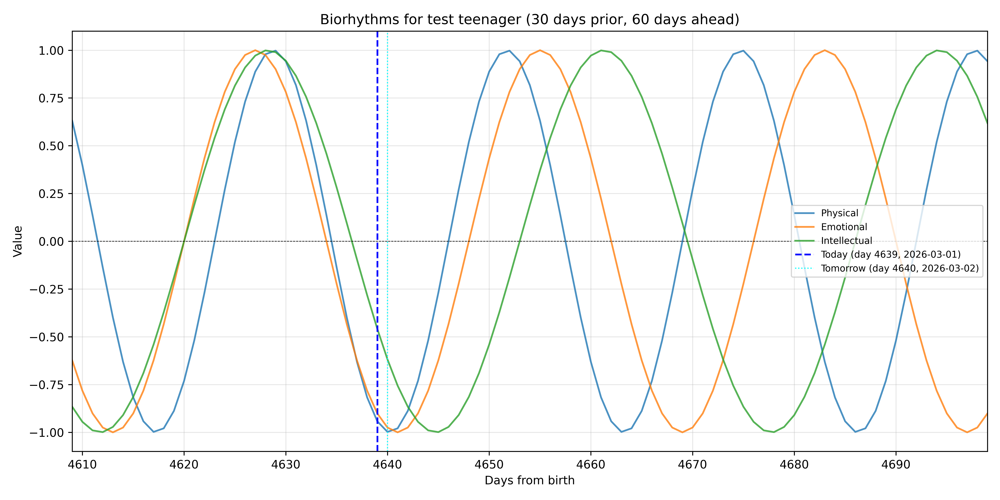
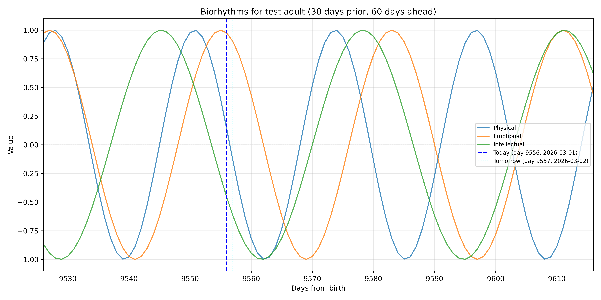

# Lab01

## Task01: Biorhythms

`biorhythm.py` is a Python script to calculate and plot user biorhythms and give information about the current phase they are in.

***Usage***:
```bash
python biorhythm.py
```
Afterwards answer the prompts with information.

### Output
The console will give you information regarding your phase and the plot will be saved in `lab01/biorhythms/output/biorhythm_plot.png` with a visual representation of your biorhythms for 30 days prior and 60 days ahead.

### Console output example
```yaml
Hi, give me your name and date of birth
What is your first name? John
What is your last name? Doe
What day were you born? (YYYY-MM-DD) 1990-01-01

Okay, buckle up John Doe it's time for the maths!

Your age in days is 13208

physical_biometric = 0.9976687691905489
Your physical biorhythm is good!

emotional_biometric = -0.9749279121818011
Your emotional biorhythm is bad...
And it will be worse tomorrow :)

intellectual_biometric = 0.9988673391830092
Your intellectual biorhythm is good!

All three biorhythms will intersect at approximately 0.975 on day 17002
That will be on: 2036-07-20
You will be 46 years and 7 months old at that time.

Plot saved to lab01/biorhythms/output/biorhythm_plot.png
```

### Plot output examples

**Biorhythm plot for 2026-02-15**

> the only biorhythm that shows the marked birthday as it's withing the visible range of -30 days.

**Biorhythm plot for 2013-11-17**


**Biorhythm plot for 2000-01-01**


### Math explanation

The graphs intersect at very specific points that's why multiple users will share their closest intersection point. I tried to graph it nicely, but failed horribly, so here's your link to desmos and you're free to scroll to the x (day value) and compare:
`https://www.desmos.com/calculator/7qzzhhujeu`

### Report information:
Time taken (rough estimates):
20 minutes to make the structure and put the plans on the board
25 minutes to write the code and figure out the maths (ignoring the plotting part)
60? minutes to make the plotting logic and formatting
15 minutes to write the report and make the screenshots

### `biorhythm_ai_fix.py` (task D)

Noticeable changes:
- Added Constants for better readability
- Improved data validation (re-prompting for invalid inputs)
- Moved things into functions

### `biorhythm_ai_gen_context.py` (task E)
> It had full access to the codebase and was able to use the original code as reference.

prompt:
```
Your job is to create a python program that prompts the user for their name and date of birth and utilise that to calculate their biorhythm data.

The program should calculate their biorhythm physical, emotional and intellectual cycles and output them in the console.

In cases where the value is above 0.5 or below -0.5 it should motivate or reassure the user. In cases where the value is below -0.5 it should inform the user if the next day's value is higher or lower.

Utilise matplotlib library to plot the user's cycles in a range -30 days from today and +60 days from today. In cases, where their birthday is visible (infants) mark it on the plot.

As a trivia (not marked on the plot), print in the console the date their cycles are the closest to intersecting with each other (assume 5% tolerance) to either -1, 0 or 1 values and print in the console the date that will happen and the predicted age the user will be.

Plot result should be stored in a named filed in a directory called output inside the biorhythms directory inside current directory. Plot should be visually appealing and understandable to the user. It should have a title, axis labels, legend and grid.
```

Model: Claude Sonnet 4.5

***Notes***:
It's worth noting that the fix and the generated code are very similar. Main difference is quality of life changes and *way* better structure. It's also worth noting that it took the humour I added due to boredom and rolled with it.

### `biorhythm_ai_gen_contextless.py` (task E*)
> It had NO access to the codebase or previously generated code. It's all generated based on the given prompt.

prompt:
```
Your job is to create a python program that prompts the user for their name and date of birth and utilise that to calculate their biorhythm data.

The program should calculate their biorhythm physical, emotional and intellectual cycles and output them in the console.

In cases where the value is above 0.5 or below -0.5 it should motivate or reassure the user. In cases where the value is below -0.5 it should inform the user if the next day's value is higher or lower.

Utilise matplotlib library to plot the user's cycles in a range -30 days from today and +60 days from today. In cases, where their birthday is visible (infants) mark it on the plot.

As a trivia (not marked on the plot), print in the console the date their cycles are the closest to intersecting with each other (assume 5% tolerance) to either -1, 0 or 1 values and print in the console the date that will happen and the predicted age the user will be.

Plot result should be stored in a named filed in a directory called output inside the biorhythms directory inside current directory. Plot should be visually appealing and understandable to the user. It should have a title, axis labels, legend and grid.
```

Model: ChatGPT-5.2

***Notes***:
Differences are mostly semantic, but the structure is similar to the code generated with context. Major differences are in the way the code is outputed to the user. The constants and moving everything into funcitons is the same as context version or the fix version. Which makes sense as it's just a better way to write it for maintainability and readability. It did add emojis, which is a love it or hate it personal thing. Biggest difference is the save location, but it's most likely due to the fact that I didn't specify the exact path in the prompt and it's a 5 second fix, so it's not a big deal.

Console output:
```yaml
Enter your name: test
Enter your date of birth (YYYY-MM-DD): 2000-01-01

--- Today's Biorhythm ---
Physical:     0.14
Emotional:    0.97
Intellectual: -0.46

🙂 test, your physical cycle is balanced today (0.14). Stay steady!
💪 test, your emotional cycle is high today (0.97). Great time to shine!
🙂 test, your intellectual cycle is balanced today (-0.46). Stay steady!

Plot saved to: /root/io/computational-intelligence-class/biorhythms/output/test_biorhythm.png

--- Trivia ---
Closest cycle intersection occurs on: 2029-02-03
Predicted age on that date: 29 years
```