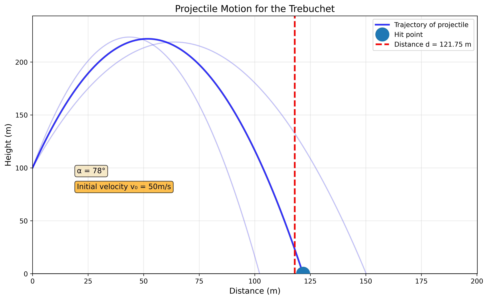
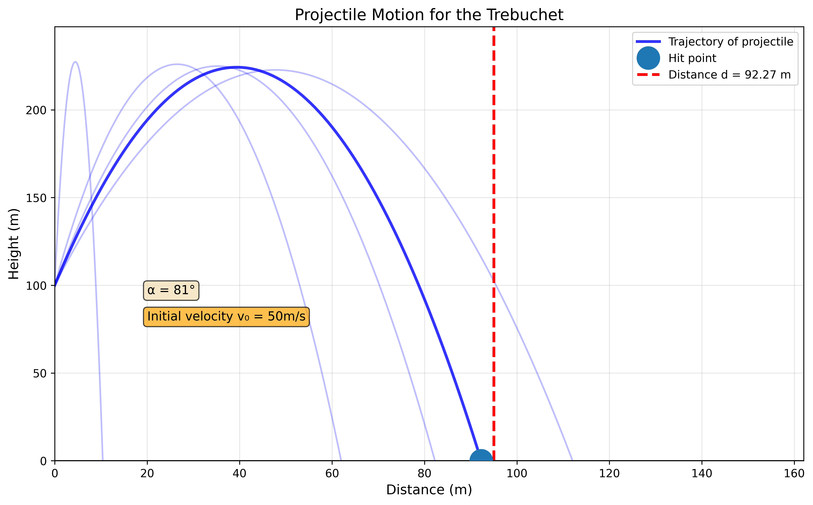
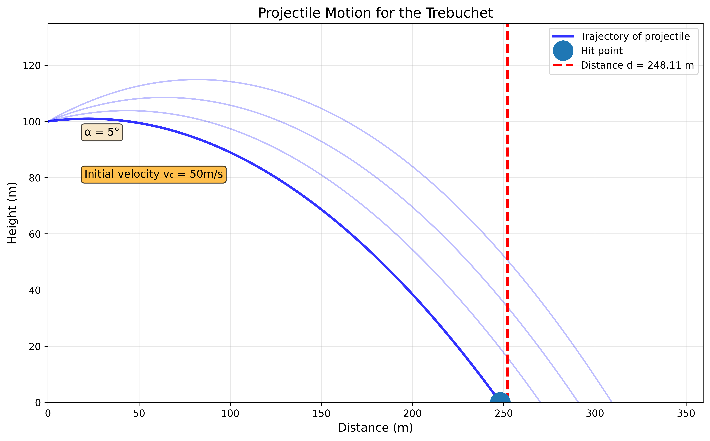

# Lab01

## Task02: Trebuchet

`trebuchet.py` is a Python script to calculate the trajectory of a projectile launched by a trebuchet and plot its path.

***Usage***:
```bash
python3 trebuchet.py
```
Afterwards answer the prompts with information about the trebuchet and the projectile.

### Console output
```yaml
==================================================
TARGET DISTANCE: 252 meters
==================================================


--- Attempt 1 ---
Enter the angle in degrees (must be between 0 and 90): 15
Shot distance: 290.90 meters
Miss! Distance error: +38.90 meters

--- Attempt 2 ---
Enter the angle in degrees (must be between 0 and 90): 20
Shot distance: 309.31 meters
Miss! Distance error: +57.31 meters

--- Attempt 3 ---
Enter the angle in degrees (must be between 0 and 90): 10
Shot distance: 270.14 meters
Miss! Distance error: +18.14 meters

--- Attempt 4 ---
Enter the angle in degrees (must be between 0 and 90): 5
Shot distance: 248.11 meters

HIT! Distance error: -3.89 meters (within 5m)

==================================================
SUCCESS! Hit target in 4 attempt(s)
Final angle: 5°
==================================================


Plot saved to trebuchet/output/trebuchet_plot.png
```
### Plot output example
**Trebuchet plot for 122m distance**

<br><br><br>
**Trebuchet plot for 92m distance**

<br><br><br>
**Trebuchet plot for 248m distance**


### Formulas used

***1. Elevated Range Formula***
The horizontal distance $d$ that the projectile travels when launched from an elevated platform can be calculated using:

```math
d = v_0 \cos(\theta) \cdot \frac{v_0 \sin(\theta) + \sqrt{(v_0 \sin(\theta))^2 + 2gh}}{g}
```

Where:
- $d$ is the horizontal distance traveled (in meters)
- $v_0$ is the initial velocity of the projectile (50 $m/s$)
- $\theta$ is the launch angle (converted from degrees to radians)
- $g$ is the gravitational acceleration (9.81 $m/s^2$)
- $h$ is the initial height of the platform (100 meters)

This formula accounts for the elevated launch position by calculating the time of flight using the quadratic formula for vertical motion, then multiplying by the horizontal velocity component.

***2. Trajectory Coordinates***
The projectile's position at any time $t$ is calculated using:

**Horizontal position:**
```math
x(t) = v_0 \cos(\theta) \cdot t
```
**Vertical position:**
```math
y(t) = h + v_0 \sin(\theta) \cdot t - \frac{1}{2} g t^2
```

Where:
- $x(t)$ is the horizontal distance at time $t$ (in meters)
- $y(t)$ is the height at time $t$ (in meters)
- $t$ is the time since launch (in seconds)
- All other variables are as defined above

***3. Impact Time Calculation***
The time when the projectile hits the ground ($y = 0$) is found by solving the quadratic equation:

```math
\frac{1}{2} g t^2 - v_0 \sin(\theta) \cdot t - h = 0
```
Using the quadratic formula with:
- $a = \frac{1}{2} g$
- $b = -v_0 \sin(\theta)$
- $c = -h$

The positive root gives the impact time:
```math
t_{impact} = \frac{-b + \sqrt{b^2 - 4ac}}{2a}
```

Where:
- $t_{impact}$ is the time when the projectile reaches ground level (in seconds)
- The discriminant $b^2 - 4ac$ ensures a real solution exists

> [!NOTE]
> All angle calculations in the code use `math.radians()` to convert from degrees to radians, as Python's trigonometric functions expect radian input.
