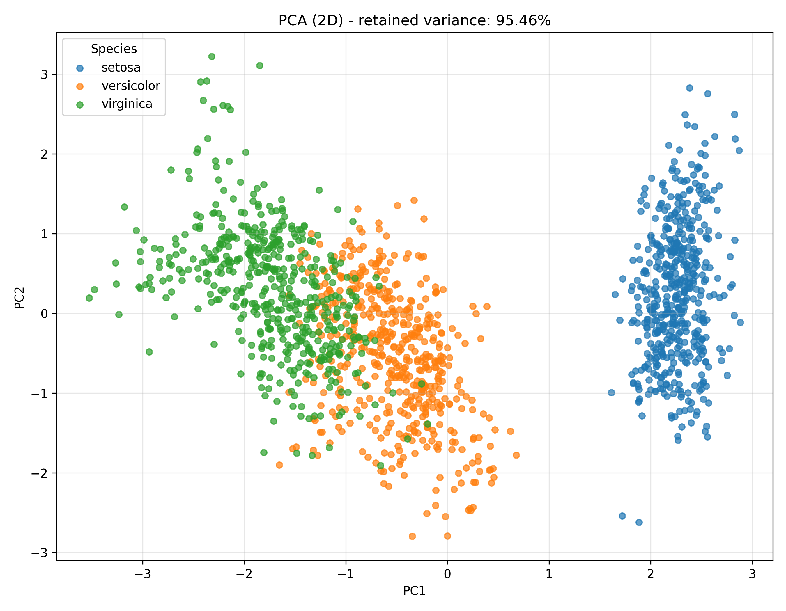

# Lab02

## Task02: Principal Component Analysis (PCA)

`principal_component_analysis.py` is a Python script that performs PCA on the clean Iris dataset (`iris_big.csv`) to reduce dimensionality while keeping at least 95% of the information (variance).

***Usage***:
```bash
python3 principal_component_analysis.py
```

The script reads `../data/iris_big.csv`, computes PCA on 4 numeric columns, determines the minimum number of components needed for $>=95%$ retained variance, and generates the minimal required plot.

### Console output
```yaml
=======================================================
PCA ANALYSIS - IRIS DATASET
=======================================================
Input file: /root/io/computational-intelligence-class/lab02/data/iris_big.csv
Rows: 1500
Numeric columns: 4

Explained variance ratio per principal component:
PC1: 0.742217
PC2: 0.212363
PC3: 0.038357
PC4: 0.007064

Cumulative explained variance:
PC1..PC1: 0.742217
PC1..PC2: 0.954579
PC1..PC3: 0.992936
PC1..PC4: 1.000000

Formula justification:
sum(var(column[k]) for k=n-1..n-i) / sum(var(column[k]) for k=n-1..0)
= 0.954579 / 1.000000 = 0.954579

Minimum components for >= 95% variance: 2
Columns that can be removed: 2
Retained variance: 95.46%
Information loss: 4.54%

Generated minimal required plot: /root/io/computational-intelligence-class/lab02/task02/output/plot_2D.png
```

### Result summary

- Original numeric dimensions: `4`
- Dimensions after PCA: `2`
- Removed columns: `2`
- Retained variance: `95.46%`
- Information loss: `4.54%` (within allowed max 5%)

Based on the 95% rule, reducing from 4 to 2 dimensions is fine...

### Plot output

**PCA scatter plot (2D):**


### Graph interpretation

- `setosa` is clearly separated from the other species, forming a distinct cluster.
- `versicolor` and `virginica` are closer to each other and show visible overlap in the middle region.
- This means PCA in 2D preserves enough structure to separate `setosa` very well, but the boundary between `versicolor` and `virginica` is less sharp.

### Short conclusion

PCA successfully compressed the dataset from 4 to 2 numeric columns while preserving more than 95% of variance. The visualization confirms strong separability for `setosa`, while `versicolor` and `virginica` partially overlap, which is expected for Iris data.
