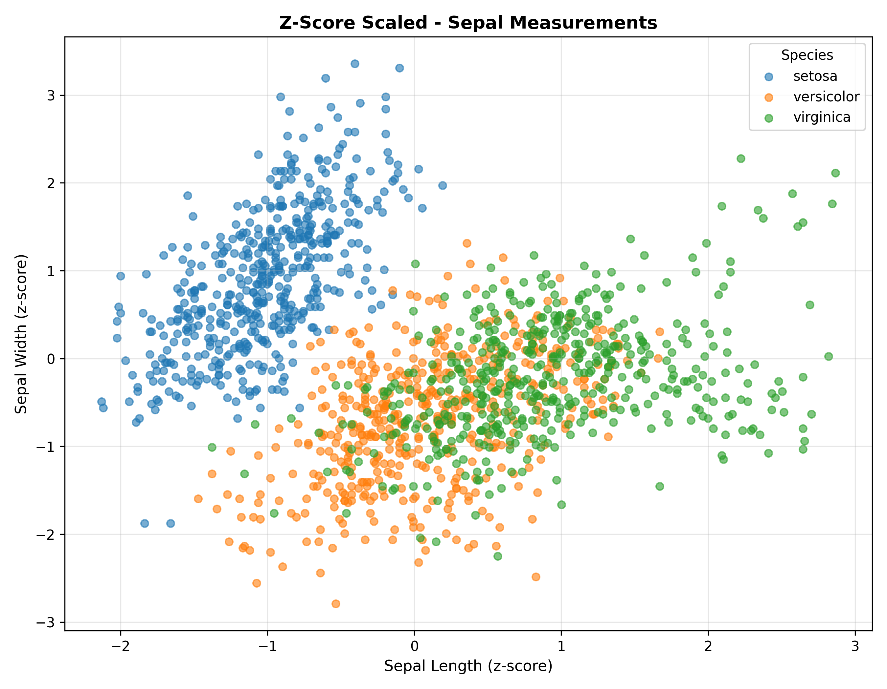

# Lab02

## Task03: Dataset Normalization

`dataset_normalizer.py` is a Python script that compares three normalization methods applied to Iris sepal measurements: original data, min-max normalization [0,1], and z-score standardization.

***Usage***:
```bash
python3 dataset_normalizer.py
```

The script reads `../data/iris_big.csv`, extracts sepal length and width, applies two normalization techniques, computes statistics, and generates three scatter plots in the `output/` directory.

### Console output
```yaml
============================================================
DATASET NORMALIZATION - IRIS SEPAL MEASUREMENTS
============================================================
Dataset: /root/io/computational-intelligence-class/lab02/data/iris_big.csv
Rows: 1500
Features analyzed: Sepal Length vs Sepal Width

ORIGINAL DATA:
Metric               Sepal Length    Sepal Width    
--------------------------------------------------
MIN                  4.140000        1.950000       
MAX                  8.400000        4.570000       
MEAN                 5.955380        3.139507       
STD                  0.852872        0.426142       

MIN-MAX NORMALIZED [0, 1]:
Metric               Sepal Length    Sepal Width    
--------------------------------------------------
MIN                  0.000000        0.000000       
MAX                  1.000000        1.000000       
MEAN                 0.426146        0.454010       
STD                  0.200205        0.162650       

Z-SCORE SCALED:
Metric               Sepal Length    Sepal Width    
--------------------------------------------------
MIN                  -2.128550       -2.791339      
MAX                  2.866340        3.356847       
MEAN                 0.000000        0.000000       
STD                  1.000000        1.000000       

============================================================
GENERATING PLOTS
============================================================
Original plot: /root/io/computational-intelligence-class/lab02/task03/output/original_plot.png
Min-max normalized plot: /root/io/computational-intelligence-class/lab02/task03/output/min_max_normalised_plot.png
Z-score scaled plot: /root/io/computational-intelligence-class/lab02/task03/output/z_score_scaled_plot.png
```

### Normalization methods

**1. Original data**
- Raw sepal measurements in centimeters
- Sepal length: 4.14 - 8.40 cm (mean = 5.96)
- Sepal width: 1.95 - 4.57 cm (mean = 3.14)

**2. Min-max normalization**
- Formula: $x_{norm} = \frac{x - x_{min}}{x_{max} - x_{min}}$
- Maps all values to [0, 1] range
- Preserves distribution shape and relative distances
- Range after normalization: [0, 1] for both features

**3. Z-score standardization**
- Formula: $x_{scaled} = \frac{x - \mu}{\sigma}$
- Centers data around mean = 0 with std = 1
- Makes features comparable on same scale
- Range after scaling: approximately $[-3, +3]$ for most values

### Plot outputs

**Original data scatter plot:**


**Min-max normalized scatter plot:**


**Z-score scaled scatter plot:**


### Graph interpretation

All three plots show the same underlying data with different axis scales:

- **Species separation:** All three methods preserve the species clustering structure. The scatter pattern remains identical, only the scale changes.
- **Min-max normalization:** Compresses the original range proportionally to [0, 1]. The distribution shape is preserved exactly, making it ideal when you need bounded values.
- **Z-score scaling:** Centers data around origin (0, 0) and normalizes spread to σ=1. This makes outliers more visible (points beyond $±2σ$ or $±3σ$ stand out clearly).

### Short conclusion

Normalization changes the scale but preserves the distribution structure. Min-max is useful for algorithms sensitive to value ranges (e.g., neural networks with activation functions). Z-score is better for comparing features with different units or when outlier detection matters. Both methods maintain the relative distances between points, so species clustering remains unchanged.
