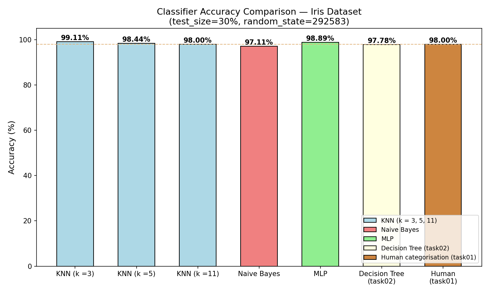
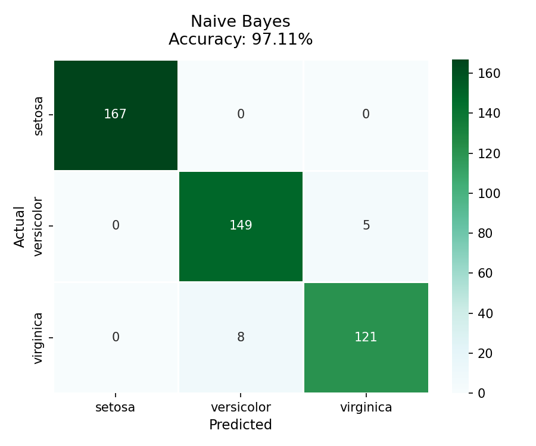
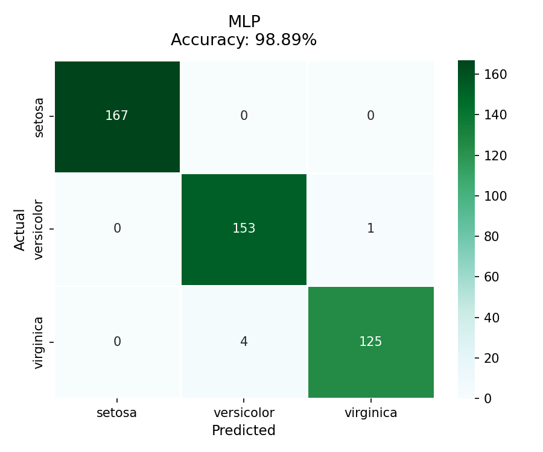

# Lab03

## Task03: Multi-Classifier Comparison

`classificators.py` trains and evaluates five classifiers on the same Iris dataset (`iris_big.csv`) using the **identical split** as task02 (`test_size=0.3`, `random_state=292583`), enabling a direct accuracy comparison with the Decision Tree baseline from task02.

***Classifiers evaluated***:
- KNN with $k = 3$, $k = 5$, $k = 11$
- Naive Bayes (Gaussian)
- MLP — one hidden layer, 100 neurons, `max_iter=500`

***Usage***:
```bash
python3 classificators.py
```

### Console output
```yaml
==========================================================================================
MULTI-CLASSIFIER COMPARISON — IRIS DATASET
==========================================================================================
Input file: /root/io/computational-intelligence-class/lab03/data/iris_big.csv
Full dataset shape: (1500, 5)
Split configuration: train=70%, test=30%, random_state=292583
Training samples: 1050  |  Test samples: 450
Classes: ['setosa', 'versicolor', 'virginica']

------------------------------------------------------------------------------------------
  KNN (k = 3)
------------------------------------------------------------------------------------------
  Accuracy (score): 99.11%
  Good predictions: 446/450
  Wrong predictions: 4/450

  Confusion matrix:
                setosa  versicolor  virginica
    setosa         167           0          0
    versicolor       0         153          1
    virginica        0           3        126

  Confusion matrix plot saved to: /root/io/computational-intelligence-class/lab03/task03/output/confusion_matrix_knn_k_3.png

------------------------------------------------------------------------------------------
  KNN (k = 5)
------------------------------------------------------------------------------------------
  Accuracy (score): 98.44%
  Good predictions: 443/450
  Wrong predictions: 7/450

  Confusion matrix:
                setosa  versicolor  virginica
    setosa         167           0          0
    versicolor       0         151          3
    virginica        0           4        125

  Confusion matrix plot saved to: /root/io/computational-intelligence-class/lab03/task03/output/confusion_matrix_knn_k_5.png

------------------------------------------------------------------------------------------
  KNN (k = 11)
------------------------------------------------------------------------------------------
  Accuracy (score): 98.00%
  Good predictions: 441/450
  Wrong predictions: 9/450

  Confusion matrix:
                setosa  versicolor  virginica
    setosa         167           0          0
    versicolor       0         152          2
    virginica        0           7        122

  Confusion matrix plot saved to: /root/io/computational-intelligence-class/lab03/task03/output/confusion_matrix_knn_k_11.png

------------------------------------------------------------------------------------------
  Naive Bayes
------------------------------------------------------------------------------------------
  Accuracy (score): 97.11%
  Good predictions: 437/450
  Wrong predictions: 13/450

  Confusion matrix:
                setosa  versicolor  virginica
    setosa         167           0          0
    versicolor       0         149          5
    virginica        0           8        121

  Confusion matrix plot saved to: /root/io/computational-intelligence-class/lab03/task03/output/confusion_matrix_naive_bayes.png

------------------------------------------------------------------------------------------
  MLP
------------------------------------------------------------------------------------------
  Accuracy (score): 98.89%
  Good predictions: 445/450
  Wrong predictions: 5/450

  Confusion matrix:
                setosa  versicolor  virginica
    setosa         167           0          0
    versicolor       0         153          1
    virginica        0           4        125

  Confusion matrix plot saved to: /root/io/computational-intelligence-class/lab03/task03/output/confusion_matrix_mlp.png

==========================================================================================
SUMMARY — ACCURACY COMPARISON
==========================================================================================
Classifier             Accuracy    Correct    Wrong
---------------------------------------------------
KNN (k = 3)              99.11%        446/450       4/450
KNN (k = 5)              98.44%        443/450       7/450
KNN (k = 11)             98.00%        441/450       9/450
Naive Bayes              97.11%        437/450      13/450
MLP                      98.89%        445/450       5/450
Decision Tree (task02)   97.78%        440/450      10/450  [reference]
Human (task01)           98.00%        441/450       9/450  [reference]

Accuracy comparison chart saved to: /root/io/computational-intelligence-class/lab03/task03/output/accuracy_comparison.png
```

### Result summary

| Classifier            | Accuracy | Correct | Wrong  |
|-----------------------|----------|---------|--------|
| KNN (k=3)             | 99.11%   | 446/450 | 4/450  |
| MLP                   | 98.89%   | 445/450 | 5/450  |
| KNN (k=5)             | 98.44%   | 443/450 | 7/450  |
| KNN (k=11)            | 98.00%   | 441/450 | 9/450  |
| Decision Tree (task02)| 97.78%   | 440/450 | 10/450 |
| Human (task01)        | 98.00%   | 441/450 | 9/450  |
| Naive Bayes           | 97.11%   | 437/450 | 13/450 |

### Output files
- `output/confusion_matrix_knn_k3.png`
- `output/confusion_matrix_knn_k5.png`
- `output/confusion_matrix_knn_k11.png`
- `output/confusion_matrix_naive_bayes.png`
- `output/confusion_matrix_mlp.png`
- `output/accuracy_comparison.png` — bar chart comparing all classifiers + task02 decision tree + task01 human categorisation

### Data interpretation

**Setosa**: All classifiers classified all 167 setosa samples in the test set correctly.

**Versicolor / Virginica overlap**: All errors occur exclusively between these two classes.

**KNN behaviour with increasing k**: Accuracy decreases as k grows ( 99.11% --> 98.44% --> 98.00% ). Smaller k gives a finer decision boundary that fits the overlap between versicolor and virginica better. Larger k takes more overlapping values, causing more misclassifications.

**Naive Bayes**: Lowest accuracy (97.11%) among the five classifiers. Gaussian NB assumes feature independence which doesn't work for

**MLP**: The simple single-hidden-layer network (100 neurons) achieved 98.89% which suggests it can capture the non-linear decision boundary.

### Comparison with task02 Decision Tree (97.78%)

| Classifier    | Accuracy | vs. Decision Tree |
|---------------|----------|-------------------|
| KNN (k=3)     | 99.11%   | + 1.33 pp         |
| MLP           | 98.89%   | + 1.11 pp         |
| KNN (k=5)     | 98.44%   | + 0.66 pp         |
| KNN (k=11)    | 98.00%   | + 0.22 pp         |
| Human (task01)| 98.00%   | + 0.22 pp         |
| Decision Tree | 97.78%   | base              |
| Naive Bayes   | 97.11%   | − 0.67 pp         |

**Four out of five**: <br>
task03 classifiers outperform the decision tree on this test set.
Naive Bayes is the only one that performs worse due to its strong independence assumptions.


### Human categorisation reference (task01)

- Human categorisation score: **98.00%** (441/450).
- It performs similarly to **KNN (k = 11)**, both at 98.00% on this split.
- It is below **KNN (k =3 )** and **MLP**, but above **Naive Bayes** and **Decision Tree**.

<br>


---

<br>

***Accuracy comparison chart***:


***Confusion matrixes***: <br>
*knn k = 3*:


*knn k = 5*:


*knn k = 11*:


*Naive Bayes*:


*MLP*:
