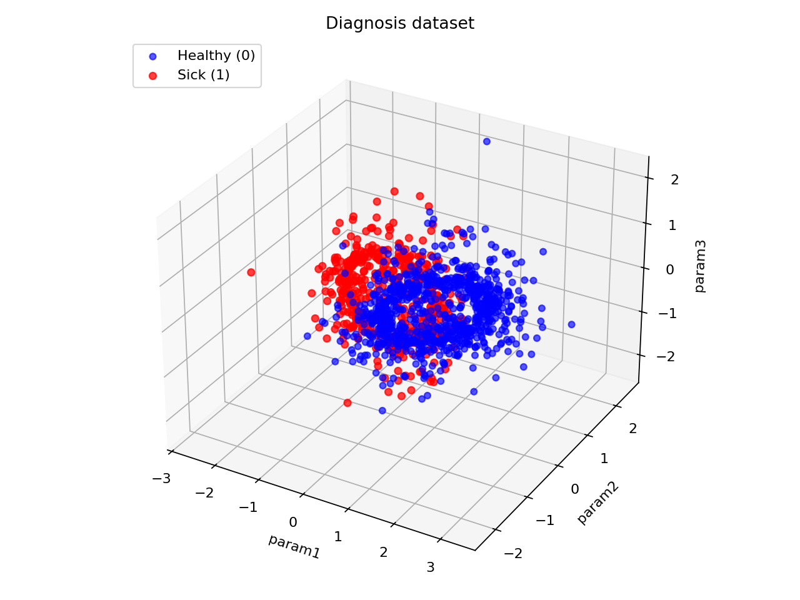
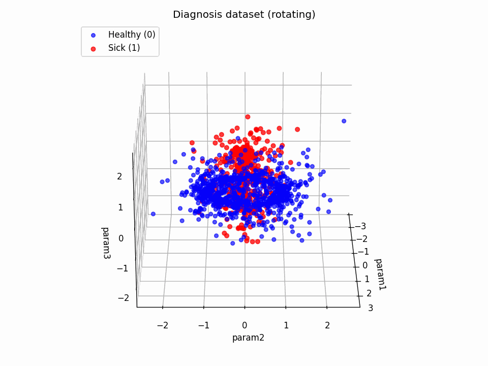
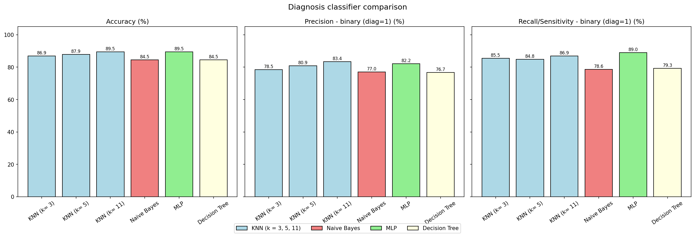
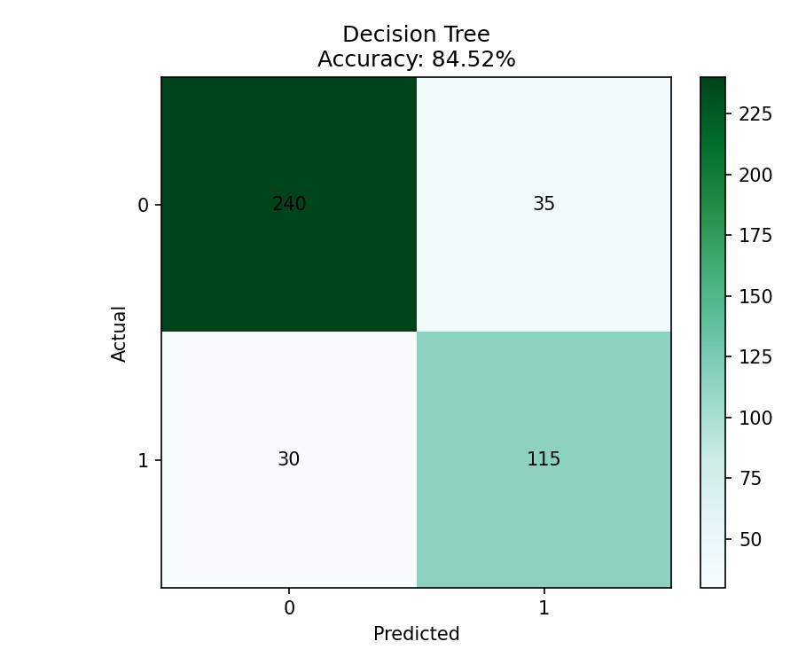
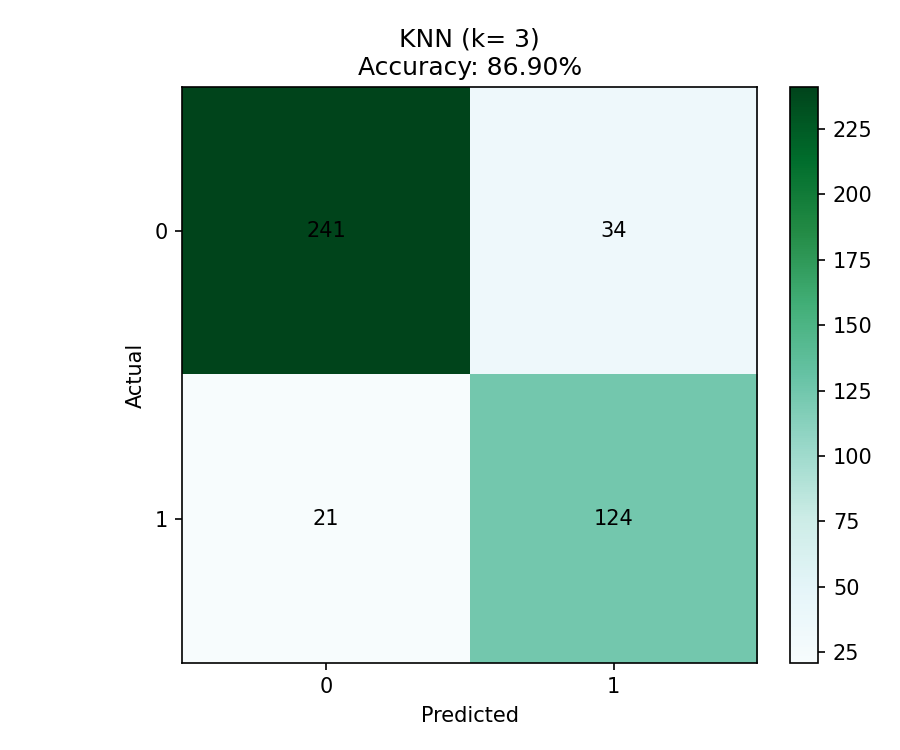
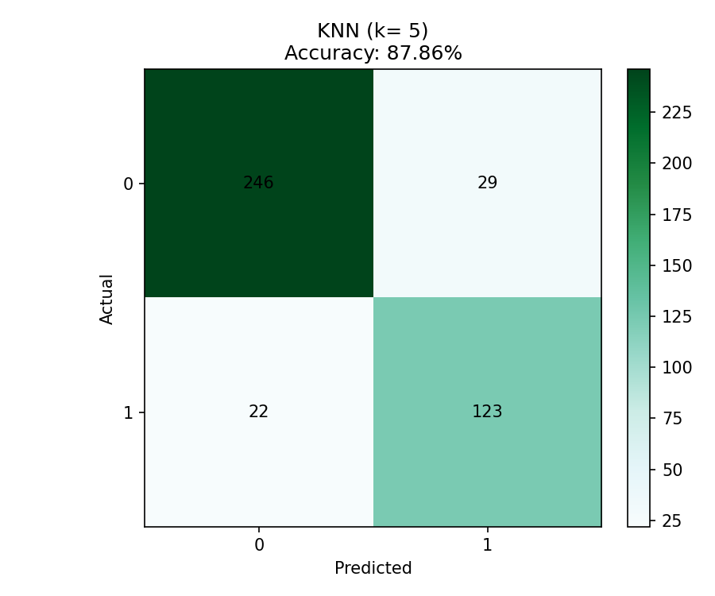
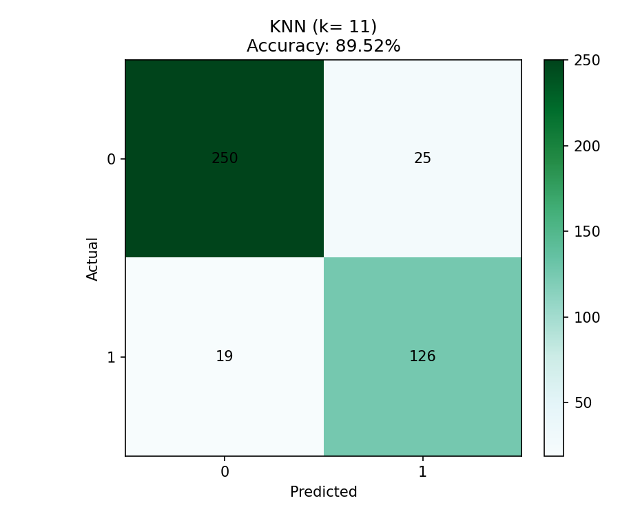
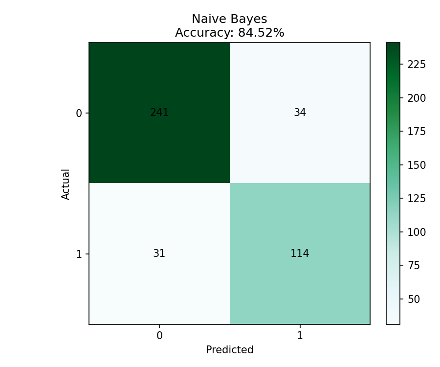

# Lab03

## Task04: Diagnosis dataset - multi-classifier comparison

`diagnosis.py` evaluates six classifiers on `diagnosis.csv` and reports:
- Accuracy
- Precision
- Recall/Sensitivity

The script computes both:
- **binary metrics** for the positive medical class (`diagnosis=1`, sick)
- **weighted metrics** across both classes (`diagnosis=0/1`)

Before classification, the script builds a required 3D scatter visualization using:
- axes: `param1`, `param2`, `param3`
- legend/colors: healthy (blue), sick (red)
- rotating GIF output

### Usage
```bash
python3 diagnosis.py
```

### Dataset and split
- Input file: `../data/diagnosis.csv`
- Shape: `1400 x 4`
- Columns: `param1`, `param2`, `param3`, `diagnosis`
- Class distribution: `diagnosis=0 -> 900`, `diagnosis=1 -> 500`
- Split: train `70%`, test `30%`, `random_state=292583`

### Classifiers
- KNN (`k=3`)
- KNN (`k=5`)
- KNN (`k=11`)
- Gaussian Naive Bayes
- MLP (`hidden_layer_sizes=(100,)`, `max_iter=500`)
- Decision Tree (`random_state=292583`)

### Output files
- `output/diagnosis_3d_scatter.png`
- `output/diagnosis_3d_rotating.gif`
- `output/confusion_matrix_knn_k3.png`
- `output/confusion_matrix_knn_k5.png`
- `output/confusion_matrix_knn_k11.png`
- `output/confusion_matrix_naive_bayes.png`
- `output/confusion_matrix_mlp.png`
- `output/confusion_matrix_decision_tree.png`
- `output/metrics_comparison.png`
- `output/diagnosis_log.csv`

### Console output summary
```yaml
==========================================================================================
DIAGNOSIS DATASET - MULTI-CLASSIFIER BENCHMARK
==========================================================================================
Input file: /root/io/computational-intelligence-class/lab03/data/diagnosis.csv
Full dataset shape: (1400, 4)
Class distribution (diagnosis): {0: 900, 1: 500}
Split configuration: train=70%, test=30%, random_state=292583
Training samples: 980 | Test samples: 420
Labels: [0, 1]


Static 3D scatter saved to: /root/io/computational-intelligence-class/lab03/task04/output/diagnosis_3d_scatter.png
Rotating 3D GIF saved to: /root/io/computational-intelligence-class/lab03/task04/output/diagnosis_3d_rotating.gif


------------------------------------------------------------------------------------------
  KNN (k= 3)
------------------------------------------------------------------------------------------
  Accuracy: 86.90%
  Precision (binary, diagnosis=1): 78.48%
  Recall/Sensitivity (binary, diagnosis=1): 85.52%
  Precision (weighted): 87.32%
  Recall (weighted): 86.90%
  Good predictions: 365/420
  Wrong predictions: 55/420


  Confusion matrix:
         0    1
    0  241   34
    1   21  124


  Confusion matrix plot saved to: /root/io/computational-intelligence-class/lab03/task04/output/confusion_matrix_knn_k_3.png


------------------------------------------------------------------------------------------
  KNN (k= 5)
------------------------------------------------------------------------------------------
  Accuracy: 87.86%
  Precision (binary, diagnosis=1): 80.92%
  Recall/Sensitivity (binary, diagnosis=1): 84.83%
  Precision (weighted): 88.04%
  Recall (weighted): 87.86%
  Good predictions: 369/420
  Wrong predictions: 51/420


  Confusion matrix:
         0    1
    0  246   29
    1   22  123


  Confusion matrix plot saved to: /root/io/computational-intelligence-class/lab03/task04/output/confusion_matrix_knn_k_5.png


------------------------------------------------------------------------------------------
  KNN (k= 11)
------------------------------------------------------------------------------------------
  Accuracy: 89.52%
  Precision (binary, diagnosis=1): 83.44%
  Recall/Sensitivity (binary, diagnosis=1): 86.90%
  Precision (weighted): 89.66%
  Recall (weighted): 89.52%
  Good predictions: 376/420
  Wrong predictions: 44/420


  Confusion matrix:
         0    1
    0  250   25
    1   19  126


  Confusion matrix plot saved to: /root/io/computational-intelligence-class/lab03/task04/output/confusion_matrix_knn_k_11.png


------------------------------------------------------------------------------------------
  Naive Bayes
------------------------------------------------------------------------------------------
  Accuracy: 84.52%
  Precision (binary, diagnosis=1): 77.03%
  Recall/Sensitivity (binary, diagnosis=1): 78.62%
  Precision (weighted): 84.61%
  Recall (weighted): 84.52%
  Good predictions: 355/420
  Wrong predictions: 65/420


  Confusion matrix:
         0    1
    0  241   34
    1   31  114


  Confusion matrix plot saved to: /root/io/computational-intelligence-class/lab03/task04/output/confusion_matrix_naive_bayes.png


------------------------------------------------------------------------------------------
  MLP
------------------------------------------------------------------------------------------
  Accuracy: 89.52%
  Precision (binary, diagnosis=1): 82.17%
  Recall/Sensitivity (binary, diagnosis=1): 88.97%
  Precision (weighted): 89.86%
  Recall (weighted): 89.52%
  Good predictions: 376/420
  Wrong predictions: 44/420


  Confusion matrix:
         0    1
    0  247   28
    1   16  129


  Confusion matrix plot saved to: /root/io/computational-intelligence-class/lab03/task04/output/confusion_matrix_mlp.png


------------------------------------------------------------------------------------------
  Decision Tree
------------------------------------------------------------------------------------------
  Accuracy: 84.52%
  Precision (binary, diagnosis=1): 76.67%
  Recall/Sensitivity (binary, diagnosis=1): 79.31%
  Precision (weighted): 84.67%
  Recall (weighted): 84.52%
  Good predictions: 355/420
  Wrong predictions: 65/420


  Confusion matrix:
         0    1
    0  240   35
    1   30  115


  Confusion matrix plot saved to: /root/io/computational-intelligence-class/lab03/task04/output/confusion_matrix_decision_tree.png


==========================================================================================
SUMMARY - METRICS COMPARISON
==========================================================================================
Classifier         Accuracy  Prec(bin)   Rec(bin)    Prec(w)     Rec(w)    Correct    Wrong
-------------------------------------------------------------------------------------------
KNN (k= 3)           86.90%     78.48%     85.52%     87.32%     86.90%        365/420      55/420
KNN (k= 5)           87.86%     80.92%     84.83%     88.04%     87.86%        369/420      51/420
KNN (k= 11)          89.52%     83.44%     86.90%     89.66%     89.52%        376/420      44/420
Naive Bayes          84.52%     77.03%     78.62%     84.61%     84.52%        355/420      65/420
MLP                  89.52%     82.17%     88.97%     89.86%     89.52%        376/420      44/420
Decision Tree        84.52%     76.67%     79.31%     84.67%     84.52%        355/420      65/420


Metrics comparison chart saved to: /root/io/computational-intelligence-class/lab03/task04/output/metrics_comparison.png
Metrics log saved to: /root/io/computational-intelligence-class/lab03/task04/output/diagnosis_log.csv
```

### Result table

| Classifier | Accuracy | Precision (binary, diag=1) | Recall/Sensitivity (binary, diag=1) | Precision (weighted) | Recall (weighted) | Correct | Wrong |
|---|---:|---:|---:|---:|---:|---:|---:|
| KNN (k=3) | 86.90% | 78.48% | 85.52% | 87.32% | 86.90% | 365/420 | 55/420 |
| KNN (k=5) | 87.86% | 80.92% | 84.83% | 88.04% | 87.86% | 369/420 | 51/420 |
| KNN (k=11) | 89.52% | 83.44% | 86.90% | 89.66% | 89.52% | 376/420 | 44/420 |
| Naive Bayes | 84.52% | 77.03% | 78.62% | 84.61% | 84.52% | 355/420 | 65/420 |
| MLP | 89.52% | 82.17% | 88.97% | 89.86% | 89.52% | 376/420 | 44/420 |
| Decision Tree | 84.52% | 76.67% | 79.31% | 84.67% | 84.52% | 355/420 | 65/420 |

### Interpretation

- Best **accuracy**: tie between **KNN (k=11)** and **MLP** at `89.52%`.
- Best **binary recall/sensitivity** for sick class (`diagnosis=1`): **MLP** at `88.97%`.
- Best **binary precision** for sick class: **KNN (k=11)** at `83.44%`.
- Because the dataset is imbalanced (`900` healthy vs `500` sick), reporting both binary and weighted metrics gives a more complete view than accuracy alone.

### Metric definitions

- **Accuracy**: fraction of correctly classified samples.
- **Precision (binary, diagnosis=1)**: among samples predicted as sick, how many are truly sick.
- **Recall/Sensitivity (binary, diagnosis=1)**: among truly sick samples, how many are correctly detected.
- **Weighted Precision/Recall**: class-wise precision/recall averaged with class-frequency weights.

<br>

**TP** - True Positives (sick correctly identified) <br>
**TN** - True Negatives (healthy correctly identified) <br>
**FP** - False Positives (healthy incorrectly identified as sick) <br>
**FN** - False Negatives (sick incorrectly identified as healthy) <br>


**Accuracy**:
```math
Accuracy = \frac{TP + TN}{TP + TN + FP + FN}
```
> How accurate the model is for EVERY case.

*Question D* <br>
If we classify all samples as "healthy" (diagnosis=0), we would get `900/1400 = 64.3%` accuracy, which shows that accuracy alone can be MISLEADING in imbalanced datasets.

<br>

**Precision**:
```math
Precision = \frac{TP}{TP + FP}
```
> When the model predicts "sick", how often is it correct?

<br>

**Recall/Sensitivity**:
```math
Recall = \frac{TP}{TP + FN}
```
> When the patient is truly "sick", how often does the model detect it?

<br>

*Question C* <br>
- Avoid classifying healthy as sick:
**precision**

- Avoid classifying sick as healthy:
**recall/sensitivity**

<br>

---

<br>

***3D Scatter plot interpretation***
<br>


***3D scatter rotating GIF***
<br>


***Metrics comparison chart***
<br>


***Confusion matrix decision tree***
<br>


***Confusion matrix KNN (k = 3)***
<br>


***Confusion matrix KNN (k = 5)***
<br>


***Confusion matrix KNN (k = 11)***
<br>


***Confusion matrix MLP***
<br>


***Confusion matrix Naive Bayes***
<br>


