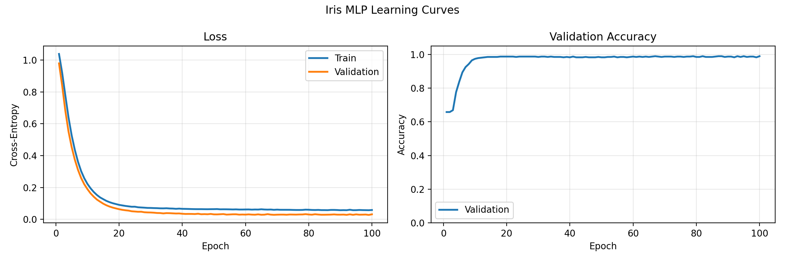
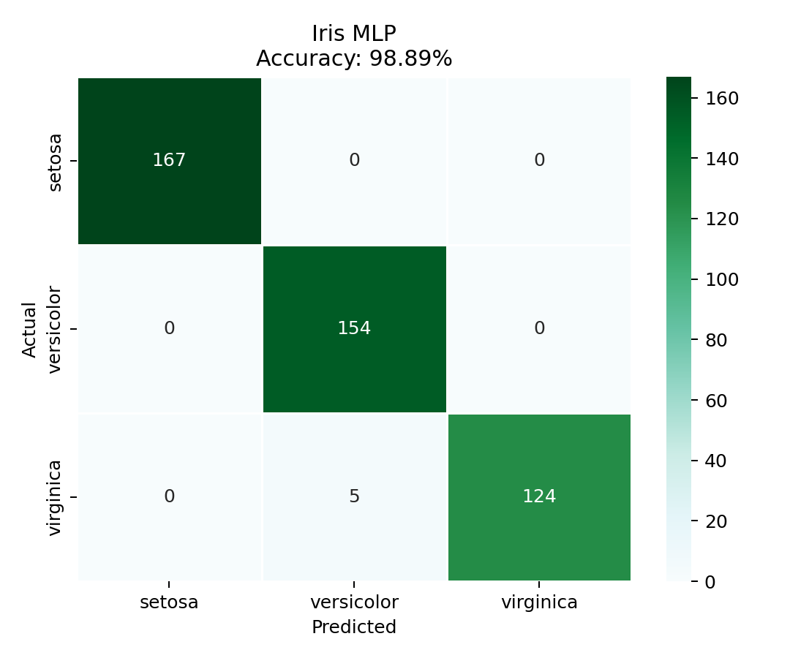

# Lab04

## Task02: Iris classification with a PyTorch MLP

- train/validation split: `70/30` (`test_size=0.3`, `random_state=292583`)
- feature standardization (fit on train set only)
- optimizer: `Adam` (`lr=1e-3`)
- loss: `CrossEntropyLoss`
- epochs: `100`
- batch size: `32`

### Usage
```bash
python3 iris_neural_network.py
```

### Topology choice
Architecture: `4 -> 16 -> 8 -> 3` (ReLU hidden layers, logits output)

- Input layer size `4` matches the four numeric Iris features.
- Output layer size `3` matches the three classes: setosa, versicolor, virginica.
- Two compact hidden layers (`16`, `8`) are large enough to model non-linear class boundaries (especially versicolor vs virginica overlap), but still small enough to avoid unnecessary parameter count.

### Console output summary (latest run)
```yaml
Epoch 001/100 | train_loss=1.0381 | val_loss=0.9789 | val_acc=65.78%
Epoch 010/100 | train_loss=0.2221 | val_loss=0.1893 | val_acc=97.33%
Epoch 020/100 | train_loss=0.0909 | val_loss=0.0636 | val_acc=98.67%
Epoch 030/100 | train_loss=0.0714 | val_loss=0.0428 | val_acc=98.44%
Epoch 040/100 | train_loss=0.0659 | val_loss=0.0350 | val_acc=98.22%
Epoch 050/100 | train_loss=0.0640 | val_loss=0.0311 | val_acc=98.22%
Epoch 060/100 | train_loss=0.0619 | val_loss=0.0297 | val_acc=98.67%
Epoch 070/100 | train_loss=0.0610 | val_loss=0.0293 | val_acc=98.67%
Epoch 080/100 | train_loss=0.0602 | val_loss=0.0303 | val_acc=98.44%
Epoch 090/100 | train_loss=0.0572 | val_loss=0.0293 | val_acc=98.67%
Epoch 100/100 | train_loss=0.0585 | val_loss=0.0315 | val_acc=98.89%

Final validation accuracy: 98.89%
Confusion matrix (validation):
     0    1    2
0  167    0    0
1    0  154    0
2    0    5  124
```

### Result summary
- Train/validation samples: `1050 / 450`
- Final validation accuracy: `98.89%`
- Best validation loss: `0.02764` at epoch `99`
- Final epoch validation loss: `0.03152`
- Final epoch train loss: `0.05846`

### Overtraining analysis
- There is **no strong overtraining** during most of training.
- Validation loss keeps improving (with small oscillations) almost until the end.
- A small overfitting signal appears at the very end: from epoch `99` to `100`, validation loss rises from `0.02764` to `0.03152` while train loss remains very low.

### Output files
- `output/training_history.csv`
- `output/learning_curves.png`
- `output/confusion_matrix.png`

### Visual outputs



