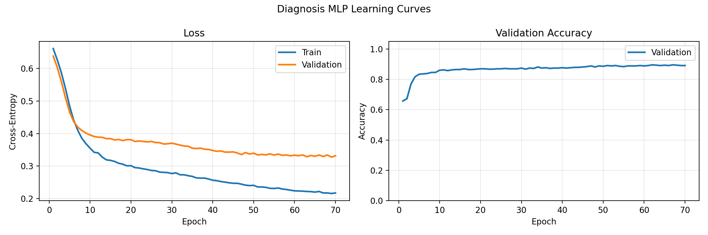
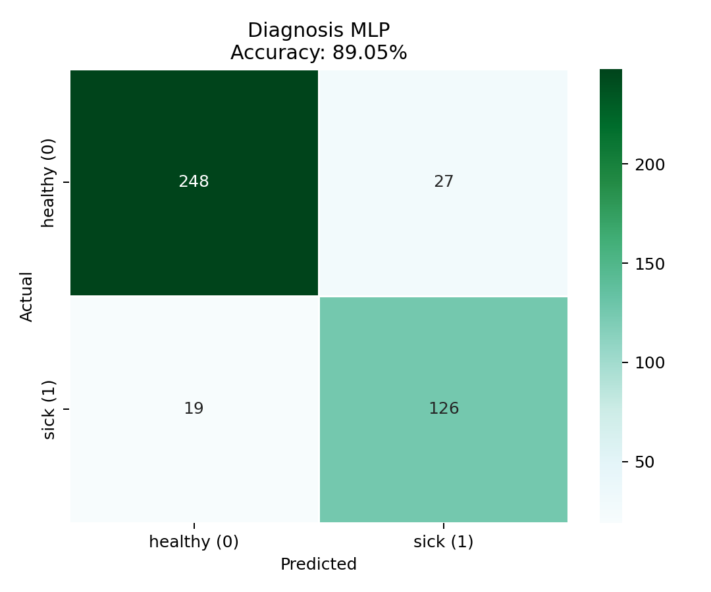

# Lab04

## Task03: Diagnosis classification with a PyTorch MLP

The script uses:
- train/validation split: `70/30` (`test_size=0.3`, `random_state=292583`)
- feature standardization (train-set statistics only)
- optimizer: `Adam` (`lr=1e-3`)
- loss: `CrossEntropyLoss`
- epochs: `100`
- batch size: `32`

### Usage
```bash
python3 diagnosis_neural_network.py
```

### Network structure
Architecture: `3 -> 16 -> 8 -> 2` (ReLU hidden layers, logits output)

- Input layer size `3` matches the dataset features (`param1`, `param2`, `param3`).
- Output layer size `2` matches binary diagnosis classes (`0`, `1`).

### Console output summary (latest run)
```yaml
Epoch 001/100 | train_loss=0.6609 | val_loss=0.6379 | val_acc=65.71%
Epoch 010/100 | train_loss=0.3551 | val_loss=0.3954 | val_acc=85.95%
Epoch 020/100 | train_loss=0.3013 | val_loss=0.3811 | val_acc=86.90%
Epoch 030/100 | train_loss=0.2770 | val_loss=0.3704 | val_acc=87.38%
Epoch 040/100 | train_loss=0.2567 | val_loss=0.3479 | val_acc=87.62%
Epoch 050/100 | train_loss=0.2408 | val_loss=0.3397 | val_acc=88.57%
Epoch 060/100 | train_loss=0.2240 | val_loss=0.3334 | val_acc=88.81%
Epoch 070/100 | train_loss=0.2174 | val_loss=0.3316 | val_acc=89.05%
Epoch 080/100 | train_loss=0.2107 | val_loss=0.3291 | val_acc=89.29%
Epoch 090/100 | train_loss=0.2093 | val_loss=0.3365 | val_acc=89.05%
Epoch 100/100 | train_loss=0.2062 | val_loss=0.3473 | val_acc=88.81%

Final validation accuracy: 88.81%
Precision (diagnosis=1): 81.41%
Recall (diagnosis=1): 87.59%
Confusion matrix (validation):
     0    1
0  246   29
1   18  127
```

### Result summary
- Train/validation samples: `980 / 420`
- Final validation accuracy: `89.05%`
- Precision (positive class = diagnosis `1`): `82.35%`
- Recall (positive class = diagnosis `1`): `86.90%`
- Best validation loss: `0.32768` at epoch `69`
- Final epoch validation loss (for 100): `0.34725`
- Final epoch train loss (for 100): `0.20616`
- Final epoch validation loss (for 70): `0.3316`
- Final epoch train loss (for 70): `0.2174`

### Overtraining analysis
- The model improves strongly until about epoch `60-70`.
- The best validation loss is reached at epoch `69`.
- After epoch `70`, validation loss starts to rise while train loss continues to decrease, indicating overfitting.

### Output files
- `output/training_history.csv`
- `output/learning_curves.png`
- `output/confusion_matrix.png`
- `output/validation_metrics.csv`

### Visual outputs



