# Comparison between OpenCV and YOLOv8 for bird counting

| name | Count | Accuracy | Notes |
|---|---|---|---|
OpenCV | 14/16 | 87.5% | Overcounted and imagined birds in background. But performed perfectly for less crowded images.
YOLOv8 | 0/16 | 0% | Failed to detect any birds in the images. Detected "possible" planes and a toilet.

## Comparison images:

> Toilet and Car come from a fallback to broader classes when nothing is detected with flying classes in Yolo, like: plane, bird, kite, etc.

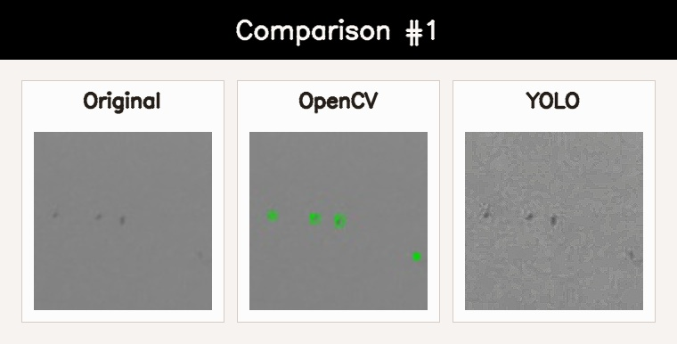
> OpenCV: 4/4 Correct  
> Yolo: 0/4

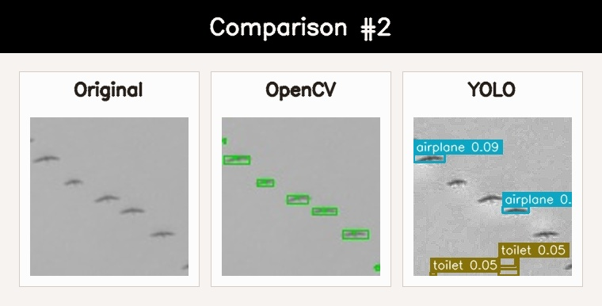
> OpenCV: 7/7 Correct  
> Yolo: 0/7 - 4 False Positives (2 planes, 2 toilets)

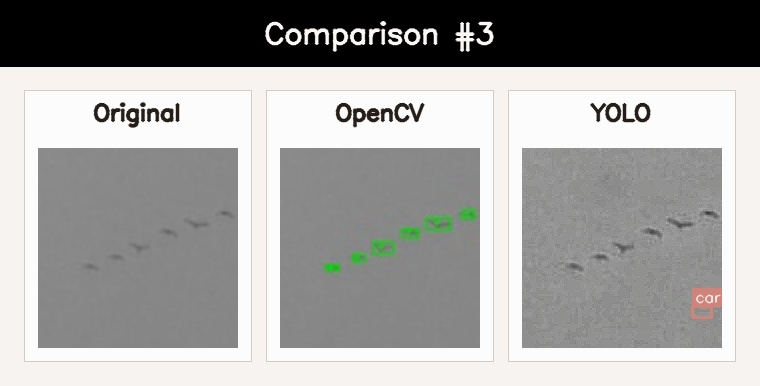
> OpenCV: 6/6 Correct  
> Yolo: 0/6 - 1 False positive (car)

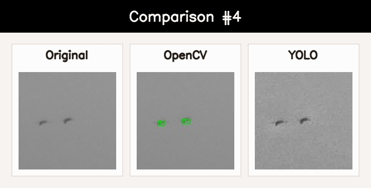
> OpenCV: 2/2 Correct  
> Yolo: 0/2

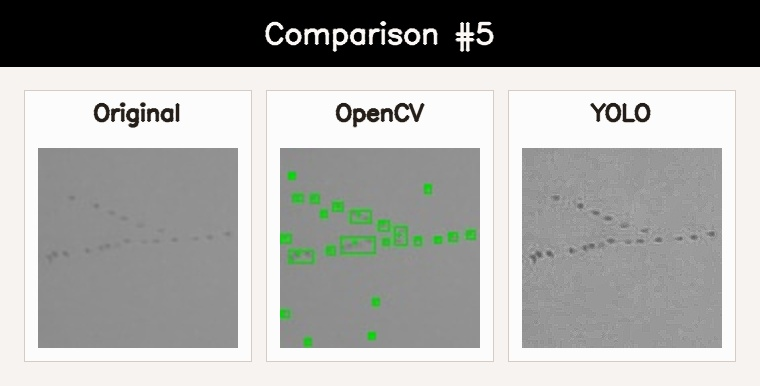
> OpenCV: 11/20 Correct - with 9 False Positives and birds clustered as one 
> Yolo: 0/2

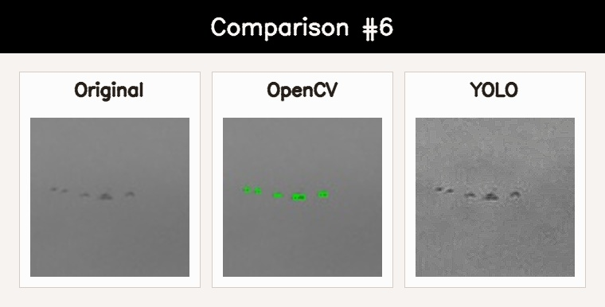
> OpenCV: 5/5 Correct  
> Yolo: 0/5

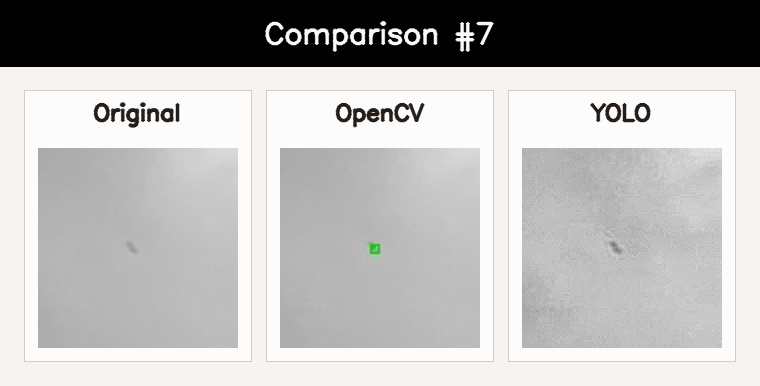
> OpenCV: 1/1 Correct  
> Yolo: 0/1

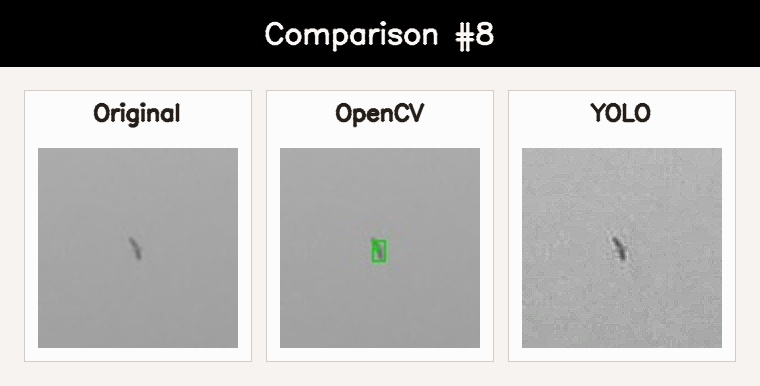
> OpenCV: 1/1 Correct  
> Yolo: 0/1

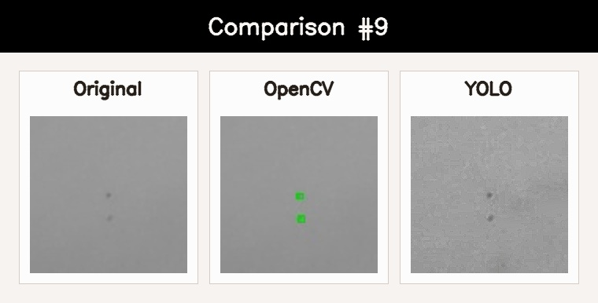
> OpenCV: 2/2 Correct  
> Yolo: 0/2

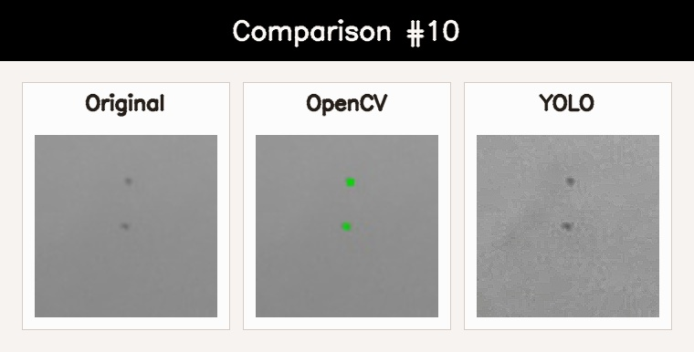
> OpenCV: 2/2 Correct  
> Yolo: 0/2

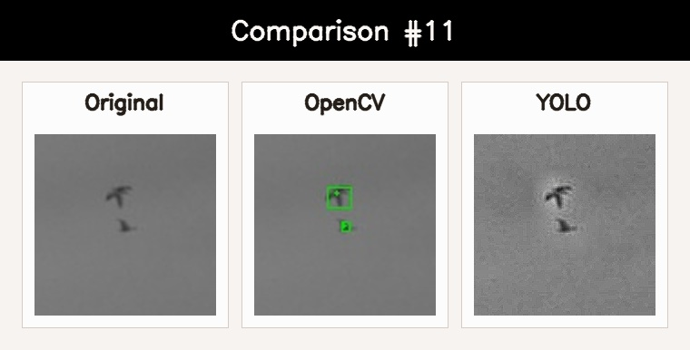
> OpenCV: 2/2 Correct  
> Yolo: 0/2

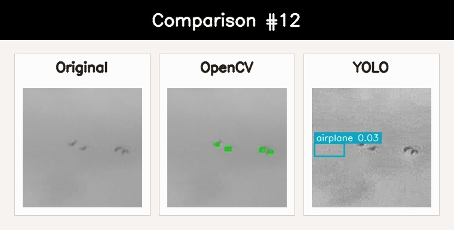
> OpenCV: 4/4 Correct  
> Yolo: 0/4 - 1 False Positive (plane)

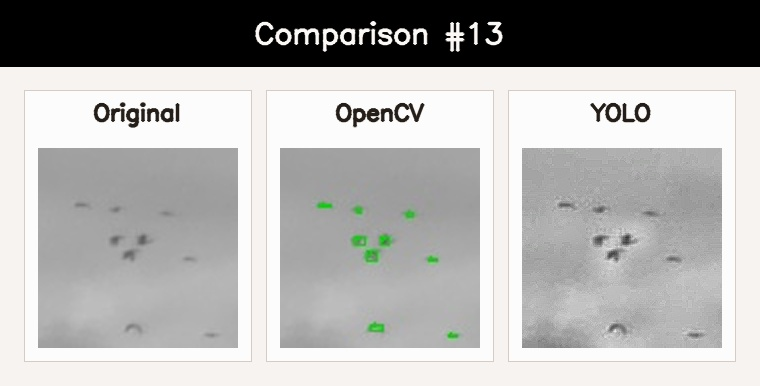
> OpenCV: 9/9 Correct  
> Yolo: 0/9

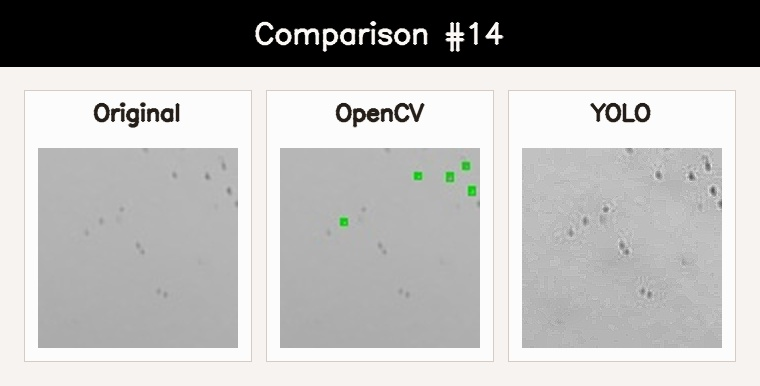
> OpenCV: 5/15-17 Correct  
> Yolo: 0/15-17

> [!WARNING]  
> I struggled to count these ones. There's a lot of shadow that is not background, so it has to be a bird, but is also not defined enough to be picked up by the detectors.

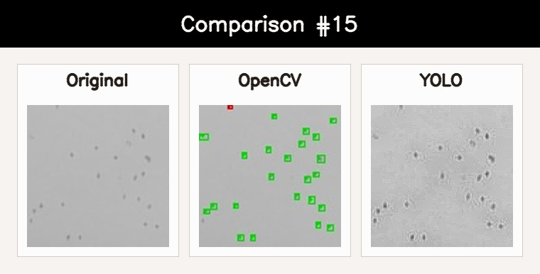
> OpenCV: 22/23 Correct - 2 False Positives. Red box means uncounted, though I marked it as correct.  
> Yolo: 0/2

> [!NOTE]  
> Red box means not accepted, but marked. That's due to the area. It's either too small or too large. In this case it's because it's right at the edge of the image and after erosion the blob becomes too small. This was meant as indicator for "pepper filter like" effects for manual checks, but in this case it fails it's job.

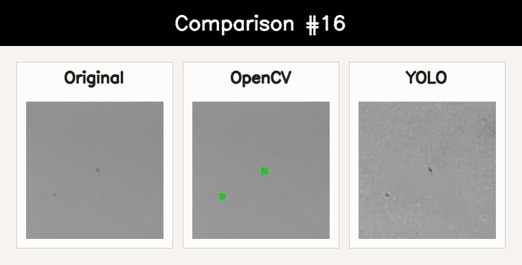
> OpenCV: 2/2 Correct  
> Yolo: 0/2