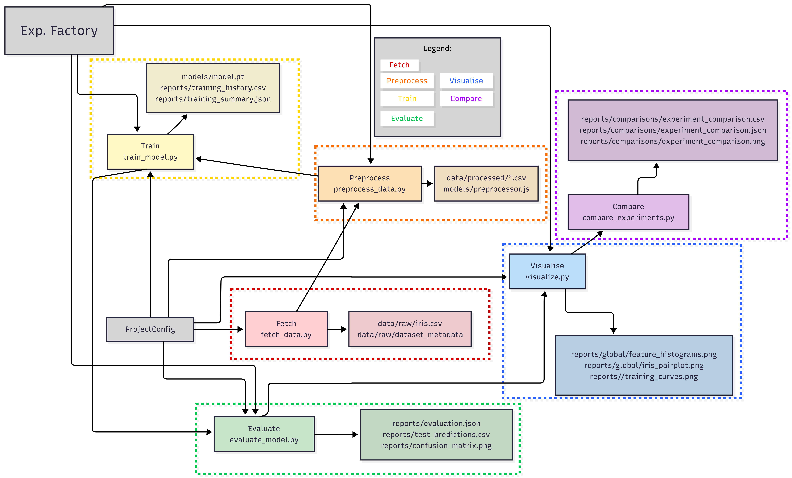
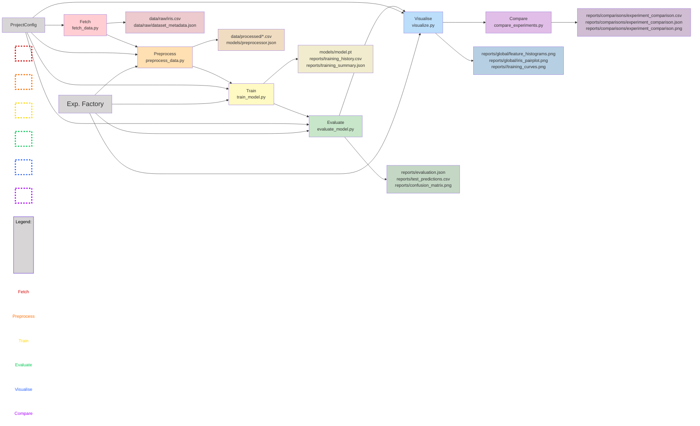

# Task01 Report

## A

### Block diagram



### What every block does

`Fetch` downloads the Iris dataset from `sklearn`, saves the raw .csv to `data/raw/` and creates dataset metadata.

`Preprocess` reads the raw data, splits it into train/validation/test sets, fits the preprocessing pipeline to the training set, and saves the processed files along with the preprocessor artifact.

`Train` loads the preprocessed data, builds a model according to the experiment configuration, and saves checkpoints and training history.

`Evaluate` loads the best model checkpoint, runs inference on the test set, and saves evaluation metrics, predictions, and confusion matrix.

`Visualise` generates exploratory plots of the raw data and training curves for a given experiment.

`Compare` collects results from multiple experiments and creates a comparison table and chart.

### Responsibility layers

- `src/cli/` contains points of entry executed from the terminal.
- `src/experiments/` manages the pipeline and selects the specific model type through `ExperimentFactory`.
- `src/data/` is responsible for loading data, splitting, and preprocessing.
- `src/models/` defines model architectures.
- `src/training/` implements the actual training and prediction.
- `src/visualization/` creates plots.
- `src/utils/` stores common tools: configuration, I/O, logging, seed and runtime.

<br>

## B

`make setup` creates a virtual environment and installs git hooks and dependencies from `pyproject.toml`.

`make pipeline` workflow:
1. fetch raw data
2. run config (that calls)
- preprocess data
- train model
- evaluate model
- visualize training
3. Generate raw data plots
4. Compare experiments

`make tests` runs pytest through uv in tests/ directory.

`make pyright` runs static type checking on the scope configured in `pyproject.toml`.

`make ruff` runs code linting and formatting with ruff.

<br>

## C

Model fields:
- Different `Epochs`, `learning` and `dimensions` for the model.
- different preprocessing strategies: `minmax` vs `zscore`.

Preprocessing fields:
- `minmax` vs `zscore` scaling.

Save path fields:
- `paths` for saving models, reports, and visualizations.

<br>

## D

1. Makefile calls CLI in `run_experiment.py` with the experiment name and config path.
2. Parse arguments.
3. Load and validate config with `ProjectConfig` from `src/utils/config.py`.
4. Read raw data and metadata. `src/data/dataset.py`.
5. Build experiment with `ExperimentFactory` from `src/experiments/registry.py`.
6. Run pipeline steps: preprocess, train, evaluate, visualize from `src/experiments/base.py`.

<br>

## E

1. Shared states:
- config
- logger

2. Shared pipeline:
- preprocess
- train
- evaluate
- visualise
- predict_one
- run
- load_checkpoint

<br>

## F

1. Entry point: `src/utils/config.py`
2. Constraints in individual classes

### Faulty .yaml:

Different strategy than: `zscore` or `minmax`
Different model type than: `mlp_classifier` or `linear_classifier`

Added files:
1. [faulty_linear_maxabs.yaml](./configs/faulty_linear_maxabs.yaml)
2. [faulty_additive_minmax.yaml](./configs/faulty_additive_minmax.yaml)

<br>

# G

Added file: [new_iris_mlp_zscore.yaml](./configs/new_iris_mlp_zscore.yaml)

### Comparison results:
```csv
iris_mlp_zscore,mlp_classifier,zscore,0.9666666666666667,0.9666666666666667

new_iris_mlp_zscore,mlp_classifier,zscore,0.9333333333333333,0.9333333333333333
```

### Commands shortcut:
Run new experiment:
```bash
uv run -m src.cli.run_experiment --config configs/new_iris_mlp_zscore.yaml
```

Compare experiments:
```bash
uv run -m src.cli.compare_experiments --config configs/compare_experiments.yaml
```

<br>

## H

1. Add `robust` to `src/utils/config.py`.
2. Add fit/apply functions to `src/data/preprocessing.py`.
3. Update dispatch functions.
4. Update prediction time in `src/experiments/base.py`.
5. Add tests for new preprocessor in `tests/test_preprocessing.py`.

Changed files:
1. [src/utils/config.py](./src/utils/config.py)
2. [src/data/preprocessing.py](./src/data/preprocessing.py)
3. [src/experiments/base.py](./src/experiments/base.py)
4. [tests/test_preprocessing.py](./tests/test_preprocessing.py)

## I

1. Add a new model.
2. Add a new experiment using that model.
3. Import into `__init__.py`.
4. Extend allowed model names in `src.utils/config.py`.
5. Extend factory list test.
6. Create a new config `.yaml`.
7. Add the previous config into `compare_experiments.yaml`.

### Added files:
1. [src/models/shallow_mlp.py](./src/models/shallow_mlp.py)
2. [src/experiments/shallow_experiment.py](./src/experiments/shallow_experiment.py)
3. [configs/iris_shallow_zscore.yaml](./configs/iris_shallow_zscore.yaml)

### Changed files:
1. [src/utils/config.py](./src/utils/config.py)
2. [src/experiments/__init__.py](./src/experiments/__init__.py)
3. [tests/test_experiments.py](./tests/test_experiments.py)
4. [configs/compare_experiments.yaml](./configs/compare_experiments.yaml)

### Commands shortcut:
Run new experiment:
```bash
uv run -m src.cli.run_experiment --config configs/iris_shallow_zscore.yaml
```

Compare experiments:
```bash
uv run -m src.cli.compare_experiments --config configs/compare_experiments.yaml
```

<br>

## J

1. Added `macro_f1` and `weighted_f1` to evaluation metrics in `src/experiments/base.py`.
2. Updated `compare_experiments.py` to include new metrics in the comparison table and plot.
3. Generated new comparison results with the updated metrics.

### Changed files:
1. [src/experiments/base.py](./src/experiments/base.py)
2. [src/cli/compare_experiments.py](./src/cli/compare_experiments.py)

### New comparison results:
Experiment_comparison.csv:
```csv
experiment_name,classifier,preprocessing,best_validation_accuracy,test_accuracy,macro_f1,weighted_f1
iris_mlp_zscore,mlp_classifier,zscore,0.9333333333333333,0.9333333333333333,0.9333333333333332,0.9333333333333333
iris_linear_zscore,linear_classifier,zscore,0.9333333333333333,0.9333333333333333,0.9333333333333332,0.9333333333333333
iris_linear_minmax,linear_classifier,minmax,0.9333333333333333,0.9333333333333333,0.9333333333333332,0.9333333333333333
new_iris_mlp_zscore,mlp_classifier,zscore,0.9333333333333333,0.9333333333333333,0.9333333333333332,0.9333333333333333
iris_mlp_minmax,mlp_classifier,minmax,0.9666666666666667,0.9333333333333333,0.9326599326599326,0.9326599326599326
iris_shallow_zscore,shallow_mlp_classifier,zscore,0.9333333333333333,0.9,0.899749373433584,0.8997493734335839
```

[experiment_comparison.png](./reports/comparisons/experiment_comparison.png)

<br>

## K

1. Added test for wrong and invalid input in `src/tests/test_config.py`.
- invalid preprocessing strategy.
- invalid model name.
- missing config file path.
2. Added test for wrong experiment name in `src/tests/test_experiments.py`.

<br>

### L

New command: `make report-summary` to generate a summary of the top 10 experiments based on test accuracy.

```bash
make report-summary
```


<br>

---

mermaid diagram

